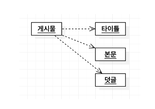
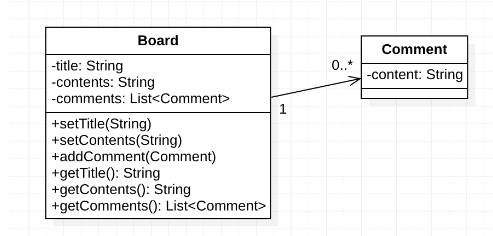
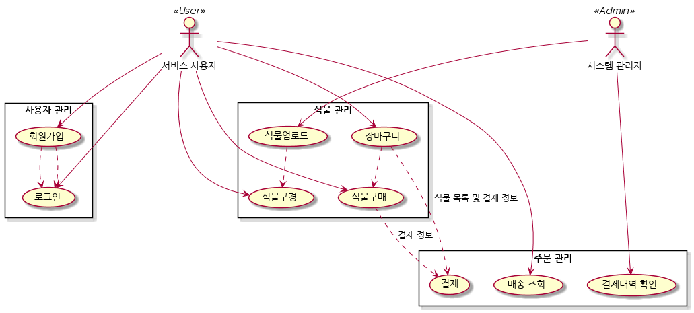
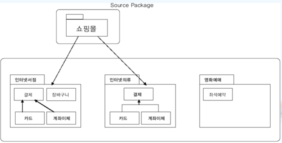
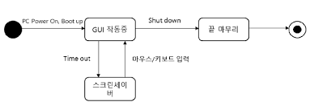
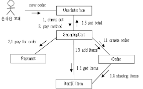
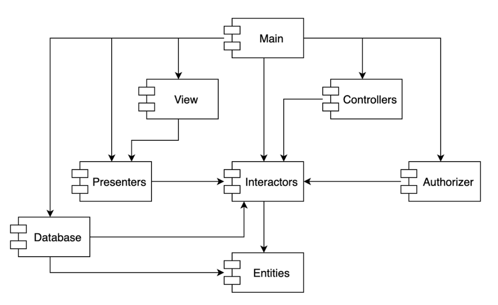

## UI 요구사항 확인

#### UI(User Interface)

> 넓은 의미 : 사용자와 시스템 사이 의사소통을 도와주는 매개체
>
> 좁은 의미: 정보 기기나 소프트웨어 등에서 사람이 접하게 되는 화면
>
> UX ⊃UI (UX = User experience)

#### UI 유형

* CLI (Command Line Interface)
  - 명령어를 텍스트로 입력하여 조작

* GUI (Graphical User Interface)
  - 그래픽 환경 기반, 마우스나 전자펜 사용

* NUI (Natural User Interface)
  - 키보드, 마우스 없이 신체 부위 이용. 터치나 음성

* OUI (Organic User Interface)
  - 현실에 존재하는 모든 사물이 입출력 장치로 변화할 수 있는 UI

#### UI 설계 원칙

* 직관성(Intuitiveness)
  - 누구나 쉽게 이해, 쉽게 사용
  - 쉬운 검색, 쉬운 사용성, 일관성

* 유효성(Efficiency)

  - 정확하고 완벽하게 사용자 목표 달성
  - 쉬운 오류 처리 및 복구

* 학습성(Learnability)

  - 초보, 숙련자 모두 사용할 수 있게 제작
  - 쉽게 학습, 쉬운 접근, 쉽게 기억

* 유연성(Flexibility)

  - 사용자 요구사항을 최대한 수용하고 실수 방지
  - 오류 예방, 실수 포용, 오류 감지

  

## UI 설계를 위한 UML

#### UML (Unified Modeling Language)

> 객체 지향 소프트웨어 개발 과정에서 산출물을 명세화, 시각화, 문서화할 때 사용되는 모델링 기술과 방법론을 통합해서 만든 표준화된 범용 모델링 언어.

> 프로그래밍 언어가 수학적 문법이나 구성으로 이루어졌다면 UML은 모델링 언어이다. 즉 설계도를 그리기 위한 언어로서, 건축 도면처럼 정해진 기호로 구조를 설명할 수 있도록 하는 언어이다.

#### UML 구성요소

* 사물(Things)
  - 주제
  - 일반적인 언어로 치면 명사나 동사에 해당

* 관계 (Relationships)
  - 사물과 사물을 연결하여 관계를 표현하는 요소
  - 사물의 의미를 확장하고, 명확히 함
  - 형용사 또는 부사
* 다이어그램(Diagrams)
  - 사물과 관계를 모아 그림으로 표현한 형태

## UML 다이어그램

#### 1. 클래스(class)

- 클래스의 구성요소 및 클래스간의 관계를 표현

- 구조적/정적 다이어그램

- 클래스 다이어그램의 용도

  - 보이지 않는 도메인 안과 같은 추상적인 개념을 기술하기 위한 용도 

    

  - 소프트웨어의 설계 혹은 완성된 소프트웨어의 구현 설명을 위한 용도

    

* 클래스 다이어그램 구성요소
  - 클래스(class): 공통적인 속성이나 메서드, 관계, 의미를 공유하는 객체들의 집합. 비슷비슷한 애들
  - 속성(Attribute): 클래스의 구조적 특성에 이름을 붙인 것. 비슷비슷한 애들을 묶은 특성
  - 연산(Operation), 메서드: 클래스의 행위적 특징
  - 접근 제어자(Access Modifier): 클래스에 접근할 수 있는 정도를 표현(-:클래스내부 접근만 허용 / +:클래스 외부 접근을 허용)
* 클래스간의 관계: 연관, 집합, 포함, 일반화, 의존, 실체화 관계가 있다. (실선->은 연관, 점선->은 의존)

#### 2. 유스케이스 (usecase)

- 시스템의 기능, 서비스 및 이와 관련된 외부 요소 등을 사용자의 관점에서 표현하는 것
- 한마디로 사용자랑 시스템 사이의 관계를 나타내는 것
- 유스케이스 다이어그램 구성요소
  - 유스케이스(usecase): 시스템이 제공해야 하는 서비스, 기능 / 액터가 시스템으로 수행하는 행위
  - 액터(actor): 시스템과 상호작용 하는 사람 또는 사물, 객체. / 사용자가 시스템에 대해 수행하는 역할
  - 시스템(system): 전체 시스템의 영역
  - 시나리오: 발생되는 이벤트의 흐름
  - 이벤트의 흐름: 사람, 시스템, 하드웨어, 시간의 흐름에 의해 시작
- 유스케이스 다이어그램 관계: 포함, 확장, 일반화

#### 3. 시퀀스 (sequence)

- 객체간 상호작용을 메시지 흐름, 즉 시간의 흐름에 따라 나타내는 다이어그램
- 시퀀스 다이어그램 구성요소
  - 객체(object): 네모박스 안에 들어있음, 아래로 생명선
  - 생명선(lifeline): 점선을 따라서 시간의 흐름에 따라 발생하는 이벤트가 명시된다.
  - 실행(activation): 오퍼레이션(함수)이 실행되는 시간을 의미한다. 길수록 수행시간 긺
  - 메시지(message): 객체 간 상호작용은 메시지 교환으로 이루어진다. 한 객체에서 다른 객체로 메시지를 전달해서 전달받은 객체의 함수를 수행한다.

#### 4. 패키지(package)

- 시스템의 서로 다른 패키지들 사이 의존 관계를 표현하기 위한 다이어그램
- 패키지 다이어그램 구성요소
  - 패키지: 요소들을 그룹으로 조직하기 위한 요소
  - 의존관계: 하나의 패키지가 다른 패키지를 사용하는 관계

#### 5. 활동(activity)

- 시스템이 어떤 기능을 수행하는지를 객체의 처리 로직 또는 조건에 따른 처리의 흐름을 순서대로 표현
- 하나의 유스케이스 안 또는 유스케이스 사이에서 발생하는 복잡한 처리의 흐름을 명확하게 표현할 수 있다.
- 활동 다이어그램 구성요소
  - 시작점(Initial Node): 활동의 시작. 하나만 존재. 검은색 동그라미
  - 전이(Transition): 실행의 흐름. 화살표
  - 액션(Action, Activity): 일의 처리와 실행. 액션은 단일작업, 액티비티는 액션으로 분리될 수 있는 작업. 모서리가 둥근 사각형
  - 종료점(Final Node): 처리의 종료. 여러개 존재 가능. 검은색 동그라미 포함한 원
  - 조건(판단)노드(Decision Node): 조건에 따른 제어 흐름의 분리. 들어오는건 한개 나가는건 여러개
  - 병합 노드(Merge Node): 여러 경로의 흐름이 하나로 합쳐짐. 들어오는거 여러개 나가는거 한개
  - 포크 노드(Fork Node): 평행적으로 수행되는 흐름을 나누는 노드. 굵은 가로선
  - 조인 노드(Join Node): 나눠진 흐름을 하나로 합치는 노드.
  - 구획면(Swim Lane): 액티비티 수행을 담당하는 주체를 구분하는 면

#### 6. 상태(state)

- 하나의 객체가 자신이 속한 클래스의 상태 변화 혹은 다른 객체와의 상호 작용에 따라 상태가 어떻게 변화하는지 표현하는 다이어그램
- 어떤 이벤트에 의해 객체 자신이 속한 클래스의 상태 변화 또는 객체 간 상호 작용하는 과정에서의 상태 변화 표현
- 파악된 상태들 이외 상태는 가질 수 없고 특정 순간에는 오직 한 상태로만 존재할 수 있음
- 상태 다이어그램 구성요소
  - 상태(state): 객체가 존재할 수 있는 조건 중 하나. 둥근 사각형
  - 시작 상태: 객체의 시작 상태. 까만원
  - 종료 상태: 객체의 종료 상태. 원 안에 까만원
  - 전이: 객체의 상태가 다른 상태로 변경되는 상태
  - 이벤트(event): 객체의 전이를 유발하는 자극, 상태의 변화를 주는 현상
  - 전이 조건: 특정 조건 만족 시 전이가 발생하도록 하기 위해 사용되는 속성값의 불리언 식

#### 7. 커뮤니케이션(communication)

- 시퀀스 다이어그램처럼 동작에 참여하는 객체들이 주고받는 메시지 + 객체 간 연관까지 표현하는 다이어그램.
- 커뮤니케이션 다이어그램 구성요소
  - 액터(actor): 시스템으로부터 서비스를 요청하는 외부 요소(사람, 외부 시스템)
  - 객체(object): 메시지를 주고받은 주체, 콜론 기준으로 앞에는 객체명, 뒤에는 클래스명
  - 링크(link): 객체들 간 관계 표현
  - 메시지(message): 객체가 상호 작용을 위해 주고 받는 메시지

#### 8. 컴포넌트(component)

- 시스템을 구성하는 물리적인 컴포넌트 사이의 의존 관계를 나타내는 다이어그램

- 코드 컴포넌트 기반 물리적 구조, 실제 프로그래밍 작업에 사용

- 컴포넌트 다이어그램 구성요소

  - 컴포넌트

    탭이 달린 직사각형으로 표현

    모든 컴포넌트는 반드시 이름이 있어야 함.

    패키지에 포함되어 있으면 컴포넌트 이름 앞에 패키지 이름

  - 인터페이스: 컴포넌트와 화살표 모양 점선으로 연결

  - 의존 관계: 컴포넌트 사이 의존 관계 표현