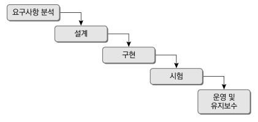
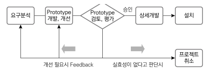
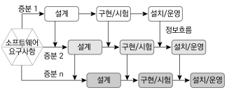
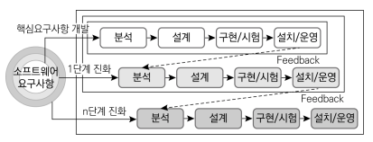
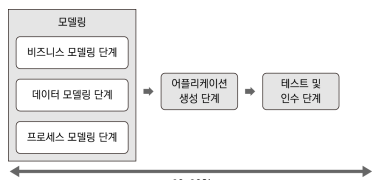
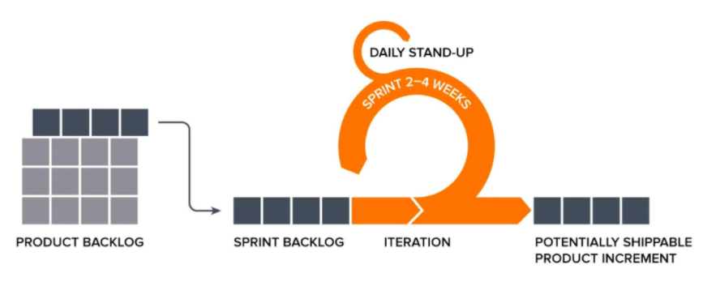
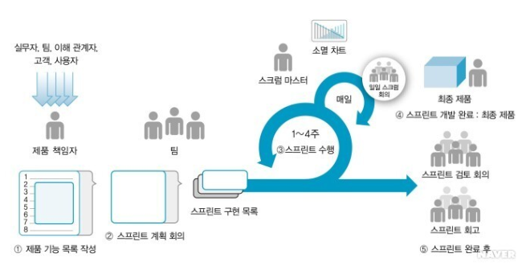

# 6/21

## 1. 소프트웨어 개발 방법론

### 1) 소프트웨어 생명주기 모델

> SDLC ; Software Development Life Cycle
>
> 시스템의 요구분석부터 유지보수까지 전 공정을 체계화한 절차
>
> 시스템이 개발될 때부터 운용과 유지보수를 거쳐 생애를 마칠 때까지 어떠한 순서를 밟는지에 대한 작업 프로세스를 모델화한 것이다.


**소프트웨어 생명주기 모델 프로세스**

> 요구사항 분석 - 설계 - 구현 - 테스트 - 유지보수

**특징**

> 1. 효율적 자원 사용
>    - 전체 프로젝트 비용 산정과 개발 계획 수립 가능한 기본 골격 제시
>    - 개발 생명주기 각 단계에 관련된 활동들 정의
> 2. 산출물 표준화
>    - 용어, 산출물 등 일관성 있도록 산출물 표준화
>    - 참여자들 간 의사소통 기준과 용어 표준화 가능케 함
>    - 단계별 활동을 통해 다음 단계에 활용될 수 있는 산출물 작성됨
> 3. 프로젝트 관리
>    - 원활한 프로젝트 수행 위한 프로젝트 관리 지원
>    - 문서화 충실한 프로젝트 관리 가능케 함


#### 소프트웨어 개발 생명주기 모델 유형

##### 1. 폭포수 모델



- 정의
  - 검토/ 승인을 거쳐 순차적 하향식으로 개발 진행되는 생명주기 모델
- 장점
  - 이해하기 쉬움
  - 다음 단계 진행 전에 결과 검증 및 관리 용이
- 단점
  - 요구도출 어려움
  - 설계/코딩/테스트 지연 가능
  - 문제 발생 시 지연 가능

- 절차

  타당성 검토 - 계획 - 요구사항 분석 - 설계 - 구현 - 테스트 - 유지보수

##### 2. 프로토타입 모델



- 정의
  - 핵심적인 기능을 먼저 만들어 평가한 후 구현하는 점진적 개발 방법
- 장점
  - 사용자 요구사항의 정확한 파악에 용이
  - 발주자와 개발자에 공통 참조모델 제공으로 시스템 이해와 품질 향상
  - 발주자와 개발자 간 의사소통 원활
  - 정확한 요구사항 파악으로 인한 위험 감소
- 단점
  - 미리 제작된 SW 사용 시 실제 SW와의 차이 발생 가능성 있음 ( 사용자에게 혼란 야기 )
  - 단기간에 제작해야 하기에 비효율적인 언어나 알고리즘 사용할 수 있음
  - 발주자가 프로토타입 모형 시제품을 완성 제품으로 오해 가능


##### 3. 나선형 모델


- 정의

  - 폭포수 모델과 프로토타입 모델 장점에 위험 분석 추가

- 장점

  - 점증적인 개발로 실패할 위험 감소
  - 테스트 용이
  - 고객 피드백 통해 SW 개선 가능

- 단점

  - 관리 복잡

- 절차

  계확 및 정의  - 위험 분석 - 개발 - 고객 평가


##### 4. 반복적 모델

1. 증분형 모델

2. 진화형 모델
3. RAD 모델


특징 - 증분방식으로 병행 개발

장점 - 병행 개발로 인한 일정 단축 가능

단점 - 병행 개발에 따른 관리 비용 증가


### 2) 소프트웨어 개발 방법론

> 소프트웨어 개발 전 과정에 지속적으로 적용할 수 있는 방법, 절차, 기법이다.
>
> 소프트웨어를 하나의 생명체로 간주하고 소프트웨어 개발의 시작부터 시스템을 사용하지 않는 과정까지의 전 과정을 형상화한 방법론이다.


| **종류**                                                   | **설명**                                                     |
| ---------------------------------------------------------- | ------------------------------------------------------------ |
| **구**조적 방법론(Structured Development)                  | - 프로세스 중심의 하향식 방법론<br />- 구조적 프로그래밍 표현을 위해 나씨-슈나이더만 차트를 사용한다. |
| **정**보공학 방법론(Information Engineering Development)   | 정보시스템 개발에 필요한 절차와 작업 기법을 체계화한 방법론<br />개발주기를 이용해 대형 프로젝트를 수행하는 체계적인 방법론 |
| **객**체지향 방법론(Object-Oriented Development)           | '객체'라는 기본 단위로 시스템을 분석 및 설계하는 방법론      |
| **컴**포넌트 기반 방법론(CBD; Component Based Development) | - 소프트웨어를 구성하는 **컴포넌트**를 조립해서 하나의 새로운 응용 프로그램을 작성하는 방법론<br />- 개발 기간 단축으로 인한 생산성 향상- 새로운 기능 추가가 쉬운 확장성- 소프트웨어 재사용이 가능 |
| ***애**자일 방법론(Agile Development)*                     | 절차보다는 사람이 중심이 되어 변화에 유연하고 신속하게 적응하면서 효율적으로 시스템을 개발할 수 있는 신속 적응적 경량 개발방법론 |
| **제**품 계열 방법론(Product Line Development)             | 특정 제품에 적용하고 싶은 공통된 기능을 정의하여 개발하는 방법론 |

\- 구조적 방법론 : 정형화된 분석 절차에 따라 사용자 요구사항을 파악하여 문서화

\- 정보공학 방법론 : 대규모 정보 시스템 구축하는데 적합

\- 객체지향 방법론 : 개체, 객체를 조립

\- 컴포넌트 기반 방법론 : 컴포넌트를 조합, 재사용 가능

\- 애자일 방법론 : 고객의 요구사항 변화에 유연하게 대응(익스트림 프로그래밍, 스크럼, 크리스탈)

\- 제품 계열 방법론 : 공통된 기능을 정의하여 개발, 임베디드 소프트웨어 만드는데 적합


#### 애자일(Agile)

> 절차보다는 사람이 중심이 되어 변화에 유연하고 신속하게 적응하면서 효율적으로 시스템을 개발할 수 있는 신속 적응적 경량 개발 방법론이다.
>
> 개발 기간이 짧고 신속하며, 폭포수 모형에 대비되는 방법론으로 개발과 함께 즉시 피드백을 받아서 유동적으로 개발할 수 있다.



**애자일의 핵심은 '협력'과 '피드백'이다.**

##### 1.협력

> 소프트웨어를 개발한 사람들 안에서의 협력을 말함(직무 역할을 넘어선 협력)

스스로 느낀 좋은 통찰은 협력을 통해 다른 사람에게도 전해줄 수 있음

예상치 못한 팀의 기대 효과를 가져옴


##### 2.피드백

학습의 가장 큰 전제조건이 '피드백'. 내가 어떻게 했는지 확인하면서 학습을 진행해야 함

소프트웨어의 불확실성이 높을 수록 학습의 중요도는 올라간다. **(모르는 게 많으면 더 빨리 배워나가야 하기 때문!!)**


일을 잘하는 사람은 이처럼 피드백을 찾는 능력 뛰어남. 더 많은 사람들에게 피드백을 구하고 발전시켜 나간다.


###### 피드백 진행 방법

```
내부적으로는 내가 만든 것이 어떻게 됐는지 확인하고, 외부적으로는 내가 만든 것을 고객이나 다른 부서가 사용해보고 나온 산출물을 통해 또 다른 것을 배워나가는 것!
```


##### 불확실성

애자일에서는 소프트웨어 개발의 불확실성이 중요함

불확실성이 높으면, `우리가 생각한거랑 다르다..`라는 상황에 직면한다.

이때 전통적인 방법론과 애자일의 방법론의 차이는 아래와 같다.

```
전통적 방법론 
: '그때 계획 세울 때 좀 더 잘 세워둘껄.. 
이런 리스크도 생각했어야 했는데ㅠ 일단 계속 진행하자'

애자일 방법론
: '이건 생각 못했네. 어쩔 수 없지. 다시 빨리 수정해보자'
```


전통적 방법에 속하는 '폭포수 모델'은 요구분석단계에서 한번에 모든 요구사항을 정확하게 전달하는 것이 원칙이다. 하지만 요즘같이 변화가 많은 프로젝트에서는 현실적으로 불가능에 가깝다.


이런 한계점을 극복해주는 애자일은, **개발 과정에 있어서 시스템 변경사항을 유연하게 or 기민하게 대응할 수 있도록 방법론을 제공**해준다.


##### 진행 방법

1. 개발자와 고객 사이의 지속적 커뮤니케이션을 통해 변화하는 요구사항을 수용한다.
2. 고객이 결정한 사항을 가장 우선으로 시행하고, 개발자 개인의 가치보다 팀의 목표를 우선으로 한다.
3. 팀원들과 주기적인 미팅을 통해 프로젝트를 점검한다.
4. 주기적으로 제품 시현을 하고 고객으로부터 피드백을 받는다.
5. 프로그램 품질 향상에 신경쓰며 간단한 내부 구조 형성을 통한 비용절감을 목표로 한다.


애자일을 통한 가장 많이 사용하는 개발 방법론이 **'스크럼'**

> 럭비 경기에서 사용되던 용어인데, 반칙으로 인해 경기가 중단됐을 때 쓰는 대형을 말함

즉, 소프트웨어 측면에서 `팀이라는 단어가 주는 의미를 적용시키고, 효율적인 성과를 얻기 위한 것`




1. ###### 제품 기능 목록 작성

   > 개발할 제품에 대한 요구사항 목록 작성
   >
   > 우선순위가 매겨진, 사용자의 요구사항 목록이라고 말할 수 있음
   >
   > 개발 중에 수정이 가능하기는 하지만, **일반적으로 한 주기가 끝날 때까지는 제품 기능 목록을 수정하지 않는 것이 원칙**

2. ###### 스프린트 Backlog

   > 스프린트 각각의 목표에 도달하기 위해 필요한 작업 목록
   >
   > - 세부적으로 어떤 것을 구현해야 하는지
   > - 작업자
   > - 예상 작업 시간
   >
   > 최종적으로 개발이 어떻게 진행되고 있는지 상황 파악 가능

3. ###### 스프린트

   > `작은 단위의 개발 업무를 단기간 내에 전력질주하여 개발한다`
   >
   > 한달동안의 큰 계획을 **3~5일 단위로 반복 주기**를 정했다면 이것이 스크럼에서 스프린트에 해당함
   >
   > - 주기가 회의를 통해 결정되면 (보통 2주 ~ 4주) 목표와 내용이 개발 도중에 바뀌지 않아야 하고, 팀원들 동의 없이 바꿀 수 없는 것이 원칙

4. ###### 일일 스크럼 회의

   > 몇가지 규칙이 있다.
   >
   > 모든 팀원이 참석하여 매일하고, 짧게(15분)하고, 진행 상황 점검한다.
   >
   > 한사람씩 어제 한 일, 오늘 할 일, 문제점 및 어려운 점을 이야기함
   >
   > 완료된 세부 작업 항목을 스프린트 현황판에서 업데이트 시킴

5. ###### 제품완성 및 스프린트 검토 회의

   > 모든 스프린트 주기가 끝나면, 제품 기능 목록에서 작성한 제품이 완성된다.
   >
   > 최종 제품이 나오면 고객들 앞에서 시연을 통한 스프린트 검토 회의 진행
   >
   > - 고객의 요구사항에 얼마나 부합했는가?
   > - 개선점 및 피드백

6. ###### 스프린트 회고

   > 스프린트에서 수행한 활동과 개발한 것을 되돌아보며 개선점이나 규칙 및 표준을 잘 준수했는지 검토
   >
   > `팀의 단점보다는 강점과 장점을 찾아 더 극대화하는데 초점을 둔다`


##### 스크럼 장점

------

- 스프린트마다 생산되는 실행 가능한 제품을 통해 사용자와 의견을 나눌 수 있음
- 회의를 통해 팀원들간 신속한 협조와 조율이 가능
- 자신의 일정을 직접 발표함으로써 업무 집중 환경 조성
- 프로젝트 진행 현황을 통해 신속하게 목표와 결과 추정이 가능하며 변화 시도가 용이함


##### 스크럼 단점

------

- 추가 작업 시간이 필요함 (스프린트마다 테스트 제품을 만들어야하기 때문)
- 15분이라는 회의 시간을 지키기 힘듬 ( 시간이 초과되면 그만큼 작업 시간이 줄어듬)
- 스크럼은 프로젝트 관리에 무게중심을 두기 때문에 프로세스 품질 평가에는 미약함


##### 요약

------

스크럼 모델은 애자일 개발 방법론 중 하나

회의를 통해 `스프린트` 개발 주기를 정한 뒤, 이 주기마다 회의 때 정했던 계획들을 구현해나감

하나의 스프린트가 끝날 때마다 검토 회의를 통해, 생산되는 프로토타입으로 사용자들의 피드백을 받으며 더 나은 결과물을 구현해낼 수 있음


---


## 2. 비용산정, 일정관리 모형

### 1. 비용산정 모델

> 소프트웨어 규모파악을 통한 투입자원, 소모시간을 파악하여 실행 가능한 계획을 수립하기 위해 비용을 산정하는 기법


| **분류**        | **설명**                                                     | **종류**                                                     |
| --------------- | ------------------------------------------------------------ | ------------------------------------------------------------ |
| 하향식 산정방법 | 경험이 많은 전문가에게 비용 산정을 의뢰하거나 여러 전문가와 조정자를 통해 산정하는 방식 | 전문가 판단, 델파이 기법                                     |
| 상향식 산정방법 | 세부적인 요구사항과 기능에 따라 필요한 비용을 계산하는 방식  | 코드 라인 수(LOC; Lines of Code)<br />Man Month<br />COCOMO 모형<br />Putnam 모형FP(Function Point) 모형 |

#### **하향식 비용산정 모델**

전문가 감정 기법 / 델파이 기법

****

****

#### **상향식 비용산정 모델**

| **모델**                        | **설명**                                                     |
| ------------------------------- | ------------------------------------------------------------ |
| LOC(Lines of Code)              | 소프트웨어 각 기능의 원시 코드 라인 수의 낙관치, 중간치, 비관치를 측정하여 예측치를 구하고 이를 이용하여 비용을 산정 |
| Man Month                       | 한 사람이 1개월 동안 할 수 있는 일의 양을 기준으로 프로젝트 비용을 산정하는 기법- <br />(Man Month) = (LOC)/(프로그래머의 월간 생산성)- <br />(프로젝트 기간) = (Man Month)/(프로젝트 인력) |
| COCOMO(COnstructive COst MOdel) | - 보헴(Bohem)이 제안한 모형으로 프로그램 규모에 따라 규모를 산정<br />- 비용 산정 결과는 프로젝트를 완성하는 데 필요한 노력(Man-Month)으로 산정 |
| Putnam                          | Rayleigh-Norden 곡선의 노력 분포도를 이용한 프로젝트 비용산정 기법,<br />Putnam 모형을 기초로 해서 만든 자동화 추정 도구로 SLIM이 있다. |
| 기능점수(FP; Functional Point)  | **기능점수 모형에서 비용산정에 이용되는 요소**<br />: 자료 입력(입력 양식) / 정보 출력(출력보고서) / 명령어(사용자 질의 수) / 데이터 파일 / 필요한 외부 루틴과의 인터페이스 |


**COCOMO의 소프트웨어 개발 유형** **(오세임)**

조직형(단순형) (**Or**ganic Mode)

\- 5만 (50KDSI) 라인 이하

반 분리형(중간형) (**Se**mi-Detached Mode)

\- 30만 (300KDSI) 라인 이하

임베디드형 (**Em**bedded Mode)

\- 30만 (300KDSI) 라인 이상


### 2. 일정관리 모델

프로젝트가 일정 기한 내에 적절하게 완료될 수 있도록 관리하는 모델

주공정법 / PERT / 중요 연쇄 프로젝트 관리


#### **CPM에서 임계 경로 기간 계산**

\- 모든 경로 중 가장 긴 경로 찾기.